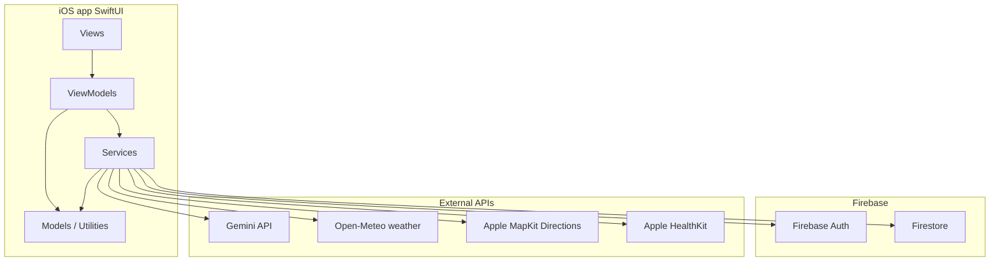

# Sentiero

**Sentiero** is an iOS hiking and outdoor-routing app built with **SwiftUI**, **MapKit**, **Firebase** (Auth + Firestore), and **Google Gemini** for AI-generated routes and checklist text. Users browse or create routes, plan trips with checklists, customize route geometry with walking directions, track walks on a live map, and optionally sync data to Apple Health.

---

## Table of contents

1. [What the app does](#what-the-app-does)
2. [How to run and configure](#how-to-run-and-configure)
3. [How to use the app (operator guide)](#how-to-use-the-app-operator-guide)
4. [Architecture and how the code works](#architecture-and-how-the-code-works)
5. [Process and technology choices](#process-and-technology-choices)
6. [File structure](#file-structure)
7. [Backend and data model (Firestore)](#backend-and-data-model-firestore)
8. [External services](#external-services)
9. [Permissions and capabilities](#permissions-and-capabilities)
10. [Security notes](#security-notes)

---

## What the app does

| Area | Behaviour |
|------|-----------|
| **Authentication** | **Sign in with Apple** or **Continue as guest** (Firebase anonymous auth). The main app only appears after Firebase reports a signed-in user. |
| **Map (home)** | Shows the user on a **MapKit** map. **Nearby public routes** from Firestore can be opened; a route card shows distance, weather (Open-Meteo), **Prepare & Checklist**, **Directions to Start** (Apple Maps), and **Start Walk** when at the trailhead. During a walk, live stats (progress along polyline, ETAs, optional segment difficulty) update from GPS. Finishing a walk shows a summary; confirming saves stats and can write a **hiking workout** to **Apple Health** (if authorized). |
| **AI Route** | User enters a natural-language prompt; the app calls **Gemini** and parses JSON into a **`TrekRoute`** with coordinates, summary, difficulty, activity type, etc. The route can be saved to the user’s cloud **saved routes**. |
| **Routes library** | **Public routes** (catalog) and **Saved AI routes** (per user in Firestore). Tapping a row focuses that route on the **Map** tab via a shared router. |
| **Plan** | **Route plans** combine a **`TrekRoute`** with a **checklist**. Plans are stored locally and synced to Firestore when signed in. Empty checklists trigger **Gemini** to generate items. Users can **rename** the plan, **start the route on the map**, and **Customize Route** (full-screen map with draggable waypoints and **MapKit walking directions** between waypoints, with throttling and fallbacks). |
| **Profile** | Local **hiking stats** (completed routes, total distance), **Apple Health** connection, **preferences** (e.g. metric vs miles), **clear public-route cache**, **reset local stats**, app version, **Sign out**. |

---

## How to run and configure

### Requirements

- **macOS** with **Xcode** (project targets a recent iOS SDK; check `IPHONEOS_DEPLOYMENT_TARGET` in the Xcode project).
- An **Apple Developer** account for device testing if you use capabilities such as **Sign in with Apple**, **HealthKit**, or push-style entitlements.
- **iOS Simulator or device** with location services for map and walk features.

### Steps

1. **Clone** the repository and open **`Sentiero.xcodeproj`** in Xcode.
2. **Swift Package Manager** resolves **Firebase iOS SDK** (`FirebaseAuth`, `FirebaseFirestore`) automatically on first open/build.
3. Add **`GoogleService-Info.plist`** from the [Firebase Console](https://console.firebase.google.com/) for your iOS app (bundle ID must match the target, e.g. `uk.sentiero.Sentiero`). The app calls **`FirebaseApp.configure()`** from `AppDelegate` in `SentieroApp.swift`.
4. **API keys (Gemini + OpenWeather)**: Copy the template **`Secrets.example.plist`** from the repo root to **`Sentiero/Secrets.plist`** (this path is **gitignored**). Edit `Secrets.plist` and set **`GeminiAPIKey`** and **`WeatherAPIKey`**. The app reads them via **`APIConfig.swift`** at runtime. Never commit `Sentiero/Secrets.plist` with real values.
5. In Xcode **Signing & Capabilities**, enable:
   - **Sign in with Apple** (matches entitlements).
   - **HealthKit** if you want Health integration (entitlements file includes HealthKit).
6. **Firestore**: create collections and security rules appropriate for your deployment (see [Backend and data model](#backend-and-data-model-firestore)).
7. **Build and run** the **Sentiero** scheme on a simulator or device.

---

## How to use the app (operator guide)

### First launch

1. Choose **Sign in with Apple** or **Continue as guest**.
2. Allow **location** when prompted (needed for map position and walk tracking).

### Map tab

1. **No route selected**: expand **Nearby Routes** and tap a route, or switch to **Routes** / **AI Route** to pick or create one.
2. With a route selected: read summary, distance, and weather.
3. **Prepare & Checklist** opens the **Plan** tab: if you already have a plan for this route (same `TrekRoute.id` in local storage), that plan is shown; otherwise a **new** plan is created and saved (and an empty checklist triggers AI generation in the plan screen).
4. **Directions to Start** opens Apple Maps to the trailhead.
5. When you are near the start (**Start** marker / trailhead logic), **Start Walk** begins GPS tracking.
6. During the walk: use **Minimize stats** / **Show walk stats** as needed; **Finish Walk** ends early if you want.
7. On completion: **View profile** or **Stay on map**; if Health is allowed, a **hiking workout** may be saved.

### AI Route tab

1. Describe the hike (distance, place, style).
2. Wait for generation; review the map and details.
3. Save to your **saved routes** when offered (Firestore under your user).

### Routes tab

1. Switch between **Public Routes** and **Saved AI Routes**.
2. Use search/filters where available.
3. Tap a row: app switches to the **Map** tab and focuses that route.

### Plan tab

1. Open a plan from the list; wait for AI checklist generation if the list was empty.
2. Tap items to mark prepared.
3. **⋯** menu: **Start route on map**, **Rename plan**, **Customize Route**.
4. **Customize Route**: drag numbered pins; the app **debounces** and recalculates walking paths via **MapKit Directions** (with rate limiting). **Save Changes** updates the plan’s geometry and distance.

### Profile tab

1. Review stats; toggle **metric** in **Preferences** if desired.
2. **Connect Apple Health** to allow workout export after walks.
3. **Clear public routes cache** refreshes the catalog on next load.
4. **Reset local hiking stats** clears in-app counters only (not Health history).
5. **Sign out** returns to the login screen.

---

## Architecture and how the code works

### High-level shape



### Application flow (3 sentences)

1. **Launch**: `SentieroApp` configures Firebase; `RootSecurityGate` shows either `LoginView` or `MainTabView` based on `AuthManager` / Firebase auth state.
2. **Data**: Public routes and user content are read/written through **`DatabaseService`**, **`CloudRouteManager`**, and **`CloudPlanManager`**; plans also persist in **`LocalPlanManager`** under **per–Firebase-UID `UserDefaults` keys** (so each signed-in account has its own local plans) and merge with cloud on the Plan hub’s `onAppear`. Hiking stats use the same UID scoping in **`LocalProfileManager`**.
3. **UI**: Each major tab owns a view + view model (or inline state); cross-tab actions use **`GlobalRouter`** (`activeTab`, `routeToFocusOnMap`, `planNavigationPath`).

### Main types

- **`TrekRoute`**: Identifiable route: name, summary, distance, start coordinates, optional polyline (`[CoordinatePoint]`), difficulty, activity, etc.
- **`RoutePlan`**: `id` (unique plan document id), `displayTitle`, `route` (`TrekRoute`), `checklist` (`[ChecklistItem]`).
- **`WalkRouteProgress`**: Live metrics along the polyline; **`WalkRouteProgressCalculator`** computes progress and supports **monotonic** progress for loop routes so distance covered does not snap backward near the start.

### Notable flows (code paths)

| Flow | Main files |
|------|------------|
| Login → main app | `SentieroApp.swift`, `AuthService.swift`, `LoginView.swift` |
| Tab shell + deep link to map route | `MainTabView.swift`, `GlobalRouter.swift`, `HomeMapViewModel.swift` (sink on `routeToFocusOnMap`) |
| Walk tracking + completion + Health | `HomeMapViewModel.swift`, `WalkRouteProgress.swift`, `RouteGeometry.swift`, `HealthKitManager.swift` |
| AI route generation | `GeminiService.swift`, `AIGeneratedRouteViewModel.swift`, `AIGeneratedRouteView.swift` |
| Plan checklist + route edit | `RoutePlanViewModel.swift`, `ActivePlanHubView.swift`, `CustomEditMapView.swift`, `RouteCalculator.swift`, `DirectionsRateLimiter.swift` |
| Plan / route sync | `LocalPlanManager.swift`, `CloudPlanManager.swift`, `CloudRouteManager.swift` |

---

## Process and technology choices

| Decision | Rationale |
|----------|-----------|
| **SwiftUI + MVVM-style view models** | Keeps views declarative; state and side effects live in `ObservableObject` types (`HomeMapViewModel`, `RoutePlanViewModel`, etc.). |
| **Firebase Auth + Firestore** | Managed auth and a document database fit per-user **savedRoutes** and **activePlans** without running a custom server for the student/prototype scope. |
| **MapKit `Map` on home, `UIViewRepresentable` for editing** | SwiftUI’s `Map` is enough for display and markers; **draggable waypoint annotations** still require **`MKMapView`** + **`MKMapViewDelegate`**, implemented in `CustomEditMapView`. |
| **Gemini over a custom ML stack** | Natural-language route and checklist generation with structured JSON responses; faster iteration than hosting routing engines. |
| **`MKDirections` + rate limiting** | Apple provides pedestrian routing; app-wide **`DirectionsRateLimiter`** and debouncing avoid **GEO throttling** (~50 requests/minute). Short legs use straight segments to save quota. |
| **Local + cloud merge for plans** | Plans remain usable offline; merge prefers richer local checklist when reconciling with Firestore. |
| **Separate `RoutePlan.id` from `TrekRoute.id`** | Allows multiple plans (e.g. variants) for the same library route without `savePlan` overwriting by route id. |
| **Apple Health opt-in** | Workouts written only after explicit authorization; distance/time derived from the tracked walk session. |

---

## File structure

```
Sentiero/
├── SentieroApp.swift          # App entry, AppDelegate (Firebase), RootSecurityGate
├── Sentiero.entitlements      # Sign in with Apple, HealthKit, etc.
├── Assets.xcassets/
├── Models/
│   ├── TrekRoute.swift        # Route model + CoordinatePoint
│   ├── RoutePlan.swift        # Plan + checklist binding to Firestore/local
│   ├── ChecklistItem.swift
│   ├── WeatherInfo.swift
│   ├── WalkCompletionSummary.swift
│   └── UserProfile.swift      # Profile-related keys (e.g. AppStorage)
├── Views/
│   ├── MainTabView.swift      # TabView + tags
│   ├── LoginView.swift
│   ├── HomeMapView.swift      # Main map, cards, walk UI
│   ├── AIGeneratedRouteView.swift
│   ├── RoutesListView.swift
│   ├── ActivePlanHubView.swift # Plan list, checklist UI, full-screen route editor shell
│   ├── CustomEditMapView.swift # MKMapView bridge, draggable waypoints
│   ├── UserProfileView.swift
│   └── ProfilePreferencesView.swift
├── ViewModels/
│   ├── HomeMapViewModel.swift
│   ├── AIGeneratedRouteViewModel.swift
│   ├── RoutesListViewModel.swift
│   └── RoutePlanViewModel.swift
├── Services/
│   ├── AuthService.swift      # AuthManager, Apple Sign-In helpers
│   ├── GlobalRouter.swift     # Shared navigation state
│   ├── DatabaseService.swift  # Public routes cache + Firestore fetch
│   ├── CloudRouteManager.swift
│   ├── CloudPlanManager.swift
│   ├── LocalPlanManager.swift
│   ├── LocalRouteManager.swift
│   ├── APIConfig.swift
│   ├── GeminiService.swift
│   ├── WeatherService.swift
│   ├── RouteCalculator.swift
│   ├── DirectionsRateLimiter.swift
│   ├── HealthKitManager.swift
│   └── UserStats.swift        # LocalProfileManager persistence
└── Utilities/
    ├── WalkRouteProgress.swift
    ├── RouteGeometry.swift
    ├── RoutePolylineStyle.swift
    ├── FirestoreCoordinateParsing.swift
    └── Constants.swift

Sentiero.xcodeproj/            # Xcode project + SPM (Firebase)
GoogleService-Info.plist       # Firebase configuration (not committed in some setups)
README.md                      # This document
```

Paths follow the synchronized `Sentiero` group in Xcode; new files under `Sentiero/` are picked up automatically.

---

## Backend and data model (Firestore)

Typical layout (exact names are defined in service classes):

| Collection path | Purpose |
|-----------------|--------|
| `public_routes` | Shared catalog of `TrekRoute`-like documents for **DatabaseService**. |
| `users/{uid}/savedRoutes/{routeId}` | User’s saved AI (or exported) routes — **CloudRouteManager**. |
| `users/{uid}/activePlans/{planId}` | User’s **RoutePlan** documents — **CloudPlanManager**. |

**Security rules** must enforce read/write only for the authenticated `uid`. The app assumes correct Firebase Auth user context when calling `setData` / `getDocuments`.

---

## External services

| Service | Role in app |
|---------|-------------|
| **Firebase Auth** | Apple and anonymous sessions. |
| **Firestore** | Public routes, saved routes, active plans. |
| **Google Gemini (Generative Language API)** | JSON route generation; checklist generation; optional enrichment of public routes (segment conditions). |
| **Open-Meteo** (via `WeatherService`) | Weather for route card on the map. |
| **MapKit / MKDirections** | Walking directions between waypoints in the route editor. |
| **Apple Maps** | Trailhead directions via `MKMapItem.openInMaps`. |
| **HealthKit** | Optional save of hiking workouts. |

---

## Permissions and capabilities

Declared in the project / entitlements (wording may vary slightly in Xcode):

- **Location When In Use** — map, nearby routes, walk tracking.
- **Health Update (and Share strings as required)** — saving workouts; see `INFOPLIST_KEY_*` in the Xcode target if using generated Info.plist.
- **Sign in with Apple** — login option.

---

## Troubleshooting

- **Build errors about `GoogleService-Info.plist`**: Add the file from Firebase Console and ensure it is included in the app target’s **Copy Bundle Resources**.
- **Gemini errors or empty routes**: Ensure `Sentiero/Secrets.plist` exists (copy from `Secrets.example.plist`), keys are set, and the plist is in the app target bundle. Check model names in `GeminiService.swift`, billing/quotas on Google AI Studio, and network access on device/simulator.
- **`Theme` or `primaryActionButton` missing**: The AI Route screen references design helpers. If your checkout does not include their definitions (e.g. in `Utilities/Constants.swift` or a dedicated theme file), restore them from your full project or replace with standard SwiftUI colors and button styles.

---

## Security notes

- Treat **`Sentiero/Secrets.plist`**, **Gemini**, **OpenWeather**, and **Firebase** configuration as secrets; `Secrets.plist` is listed in `.gitignore`.
- **Rotate** any API key that has appeared in source control or public channels.
- Review **Firestore rules** before production; never ship with open read/write to all users.

---

## License and credits

Add your institution’s license or copyright if required for your viva or submission. Sentiero is a student/academic project unless otherwise stated.

---

*This README describes the codebase as of the repository snapshot it ships with. If you add features, update the relevant sections so the document stays accurate.*
